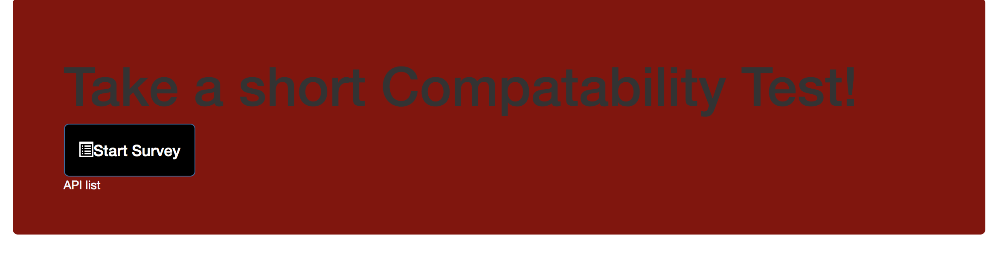
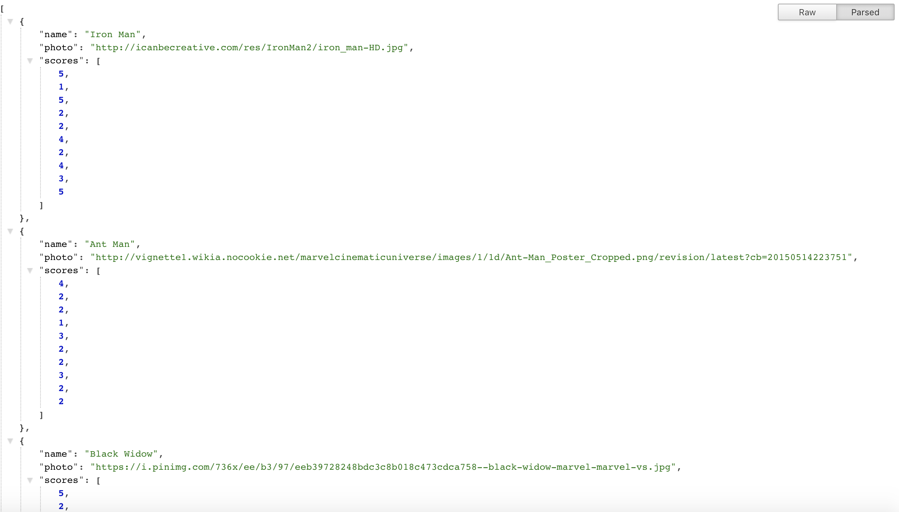
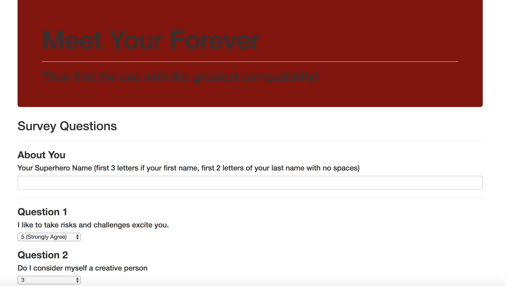
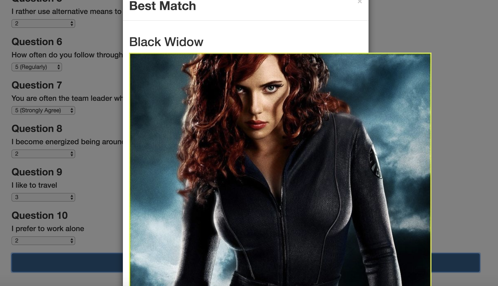

# Compatability

## Overview

Compatability will take in results from users' surveys, then compare their answers with those from other users. The app will then display the name and picture of the user with the best overall match while using Express to handle routing. Survey has 10 question form required. Each answer is on a scale of 1 to 5 based on how much the user agrees or disagrees with a question.

<<<<<<< ### Step One

1) Running this application will first display all of the items available for sale. Including the following:
 ids, names, and prices of products for sale.

=======

<<<<<<< ### Step Two

The user is able to click into the Api List to see possible matches and results in an array.

=======

<<<<<<< ### Step Three

3) For users, this is a simple 10 question survey. Behind the scenes whats happening is we are converting each user's results into a simple array of numbers (ex: [5, 1, 4, 4, 5, 1, 2, 5, 4, 1]). With that done, we compare the difference between current user's scores against those from other users, question by question. Add up the differences to calculate the totalDifference. Example: User 1: [5, 1, 4, 4, 5, 1, 2, 5, 4, 1] User 2: [3, 2, 6, 4, 5, 1, 2, 5, 4, 1] Total Difference: 2 + 1 + 2 = 5 The closest match will be the user with the least amount of difference!

=======

<<<<<<< ### Step Four

Once we've found the current user's most compatible friend, and the submit button is clicked we display the result as a modal pop-up. The modal will display both the name and picture of the closest match!

=======

